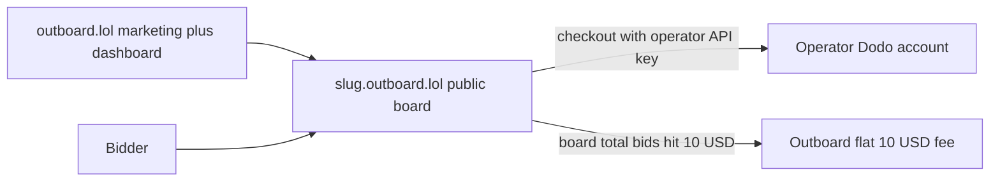
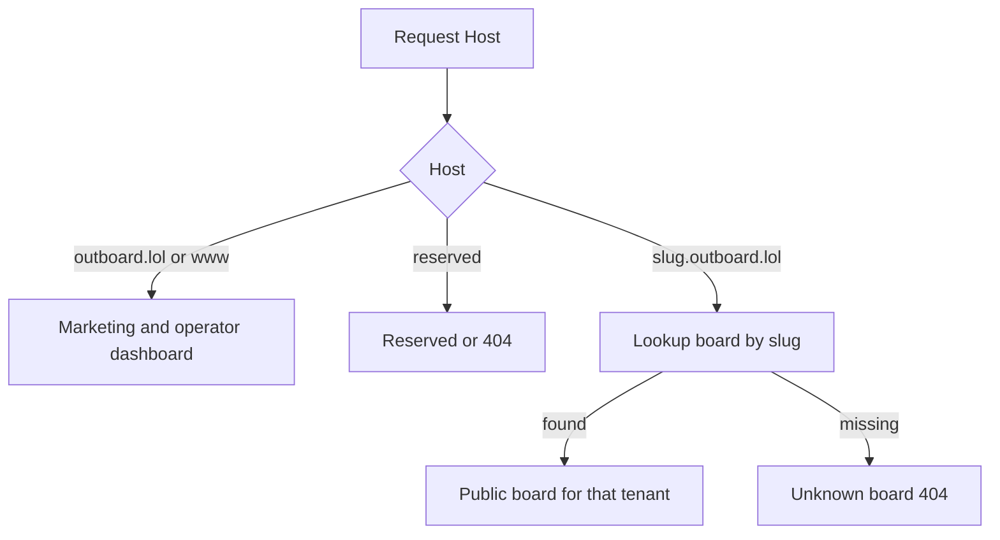
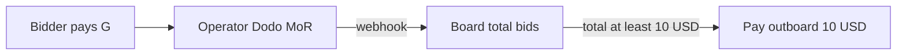

# Outboard.lol — Planning whiteboard

Living product and tech source of truth. Iterate here as decisions change; add a **Decisions log** entry instead of silently rewriting history. Visual language lives in `DESIGN.md`.

The repo is already Next.js 16.3 / React 19 / Tailwind 4 / shadcn (base-lyra) / bun. This file is not an implementation checklist.

---

## What we are building

**outboard.lol** is a hosted multi-tenant SaaS that lets anyone spin up their own pay-to-rank board in seconds — no deploy, no template, no Stripe Connect.

Each operator gets a branded public board at `{slug}.outboard.lol`. Visitors submit a product website URL and bid whole USD. Rank is bid size only. Higher bid = higher row. **0% commission** — bids go to the operator’s own Dodo account. After the board’s total bids reach $10, the operator pays a flat **$10** to keep the board live on outboard.

Core promise (same mechanic as outbid.lol, hosted for non-technical creators):

> No ads, no revenue share. Paste your Dodo key. Keep 100% of bids. Rank is a price.

Target operators: newsletter people, niche directory owners, community leads, agencies. Not developers downloading a kit.

---

## Locked product rules

These match the original outbid.lol rules unless an operator is later allowed to tighten them. Do not invent extra ranking logic.

- Currency: USD, whole dollars, $1 increments.
- Default new listing: min $5, max $999,999.
- Taking #1: at least $5 more than the current top bid. A smaller bid still lands at the highest rank it can buy.
- Equal bids: older listing keeps the higher rank.
- Rebid same listing: same URL, new total must be at least $1 above current total; bidder pays only the difference. Nobody else can steal rank by paying only that difference.
- Listing is public immediately after `payment.succeeded`.
- Allowed: product websites only. No `@handles`.
- Forbidden: chat/invite links (Telegram, Discord, WhatsApp), NSFW, link shorteners (resolve then reject), affiliate/tracking query params (strip; do not store dirty URLs).
- App Store / Play / GitHub-style paths: key by path so apps do not collide.
- Clicks go to the submitted URL with no platform query params added.
- Click counts are tracked and shown.
- Categories: later. Not in v1.

Operator-configurable now: board name, min bid, optional public links and rules. Later: logo, colors, tagline, #1 premium amount. Custom domains, decaying bids, AI bidding, sponsored slots stay out of scope.

---

## Hosting and tenancy

**Decision:** one Vercel project, wildcard subdomain, shared Postgres. Not a project-per-tenant.

- Apex `outboard.lol` and `www`: marketing site + operator signup/dashboard.
- `*.outboard.lol`: public tenant boards.
- Reserved slugs (never boards): `www`, `app`, `api`, `admin`, `dashboard`, `mail`, `status`, `docs`, `help`, `cdn`, `static`.
- Point `outboard.lol` nameservers at Vercel so Vercel can issue the wildcard cert. Then add `*.outboard.lol` on the project. Any new slug resolves without an API call per tenant.
- Resolve tenant in Next.js `proxy.ts` from `Host`: strip reserved hosts → look up slug → set `x-tenant-id`. Unknown slug → 404 board page, not the marketing site.
- Custom domains are explicitly later. Do not build Vercel `addProjectDomain` until we say so here.

---

## Money: operator Dodo + 0% commission + flat $10

**Decisions locked:** 0% platform commission on bids; each operator pastes their own Dodo Payments API key (~5 min setup); bids settle in the operator’s Dodo account; when a board’s **cumulative bid total** reaches $10, the operator must pay a flat **$10** platform fee to keep the board live.

We do **not** collect bid money, run an operator ledger for payouts, or remit to operators. Dodo pays the operator directly as MoR on their merchant account.

### Setup

- Operator creates a free board + slug.
- Dashboard: paste Dodo API key (and webhook secret as needed). ~5 minutes.
- Bids use the operator’s key / product (Pay What You Want or equivalent dynamic amount).
- Listing goes live only on verified `payment.succeeded` webhook for **that** operator’s Dodo account.

### Platform fee (locked)

- Track `board.total_bids_usd` (sum of successful bid amounts).
- When total first crosses **$10**, board enters `fee_due` — prompt operator to pay **$10** (via our Dodo / checkout).
- Until the $10 fee is paid, new bids are blocked (or board is paused — pick one at implement time; default: **pause new bids**, existing listings stay visible).
- After fee paid → `fee_paid`, board stays live. (Clarify later if fee is one-time forever or per threshold period; **v1 = one-time $10 after first $10 of bids**.)

### What we do not do

- No % take on bids.
- No operator payout ledger / Wise payouts from us.
- No “we receive all money then split.”

**Open risk to validate with Dodo:** operators acting as merchants; BYO API keys; pay-to-rank tax category / ToS for each operator account.

---

## Tech stack

Reuse what already works on yourunique.cv and what is already in this repo. Do not wander from this list without a decisions-log entry.

| Layer | Choice |
| --- | --- |
| Runtime / package manager | bun |
| Framework | Next.js 16 (App Router) |
| UI | React 19, Tailwind 4, shadcn (base-lyra), Phosphor icons |
| Auth (operators only) | Clerk — bidders have no account; Dodo collects email at checkout |
| Database | Postgres + Drizzle ORM |
| Payments | Dodo Payments — **operator BYO API key** for bids; our Dodo account only for the flat $10 platform fee |
| Hosting / domains | Vercel — one project, apex + wildcard `*.outboard.lol` |
| Explicitly not used | Prisma, Stripe |

Already present in `package.json`: Next.js 16.3, React 19, Tailwind 4, shadcn, Phosphor, bun. Clerk, Drizzle, Postgres, and Dodo packages still need to be added when we implement.

---

## Domain model (v1)

Shared schema, every row scoped by `board_id`. No schema-per-tenant.

- **Operator** — Clerk user id, encrypted Dodo API credentials, board fee status.
- **Board** — slug (unique), owner, name, min bid (default $5), optional links + rules, tagline, status, `total_bids_usd`, `platform_fee_status` (`none` | `due` | `paid`).
- **Listing** — board, canonical key (normalized URL), display URL, title, meta description, favicon URL, total bid, created_at (tie-break), click_count, status.
- **Bid** — listing, amount paid this charge, new total, Dodo payment id (unique), status.
- **Click** — listing, timestamp, coarse analytics only (no extra query params on egress).
- **PlatformFeePayment** — board, amount ($10), Dodo payment id, paid_at.

Rank query: `WHERE board_id = ? AND status = 'live' ORDER BY total_bid DESC, created_at ASC`.

Click egress: `/go/{listingId}` on the tenant host increments then 302s to the clean URL.

---

## Surfaces

- `outboard.lol` — what it is, create a board, pricing (0% commission, $10 after $10 bids).
- Signed-in dashboard — create/edit one board, slug, branding, paste Dodo key, fee status, basic clicks.
- `{slug}.outboard.lol` — public board, bid CTA, hover “claim this rank for $X”, activity later.
- `{slug}.outboard.lol/go/:id` — click redirect.

v1 is one board per operator. Multi-board is a later line in this file.
---

## What this file is not

Not a sprint list. When we implement, we add a short **Decisions log** at the bottom (date + what changed) instead of rewriting history silently.

---

## Decisions log

| Date | Decision |
| --- | --- |
| 2026-08-23 | Initial whiteboard: hosted multi-tenant outbid-style boards; Vercel wildcard `*.outboard.lol`; Dodo MoR + internal ledger; 10% cut; $50 operator payout floor; Clerk + Postgres/Drizzle; one board per operator in v1. |
| 2026-08-23 | Monetization flip: **0% commission**; operator BYO Dodo key (~5 min); flat **$10** platform fee when board total bids hit **$10**; drop operator payout ledger. |
| 2026-08-23 | Implement: shared Postgres + Drizzle (`board_id` tenancy); Host rewrite in `proxy.ts` → `/b/[slug]`; Dodo connect auto (provision product+webhook) or manual; landing `/guide/dodo`; dashboard overview/leaderboard/payments + public board. |
| 2026-08-23 | Dodo connect is **key-only**: drop manual product/webhook paste; UI shows stepped setup loader while we provision. |
| 2026-08-23 | Operators can **prepay** the flat $10 platform fee before the $10 bid threshold so bidding never pauses. |
| 2026-08-23 | Public board is claim-first (outbid-style stepper). Listings store fetched title, favicon, and meta description. |
| 2026-08-23 | Listings are **websites only**. Drop X `@handle` bids. |
| 2026-08-23 | Operator Settings: page name, min bid, optional links and rules. Shown in the public board sidebar. |
